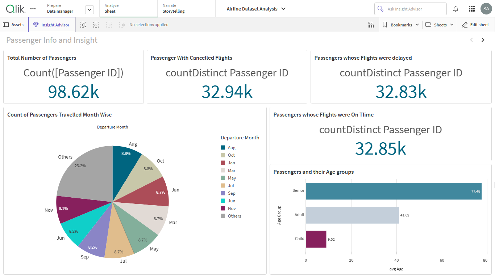
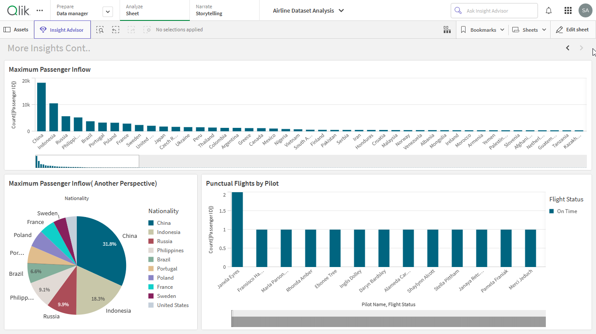

# Airline Business Analytics Dashboard with Qlik Sense

An end-to-end **Business Analytics and Data Visualization** project built with **Qlik Sense**, using synthetic airline data to explore operational performance, passenger behavior, ticket sales, and customer-related trends.

The project was completed as part of the **Virtual Internship Program on Business Analytics powered by Qlik** by SmartBridge / SmartInternz.

## Overview

The project uses a synthetic airline dataset containing information about:

* Flight schedules and operations
* Passenger demographics
* Ticket sales
* Airline performance metrics
* Customer experience indicators

The objective was to transform raw data into interactive visualizations and dashboards that could help identify **patterns, trends, and business insights** relevant to airlines and airport operations.

## Dashboard

The interactive dashboard provides visual analysis of airline performance and allows users to explore the data through filters and different analytical views.

## What I Worked On

### 1. Problem Understanding

* Defined the business problem and analytical objectives.
* Identified relevant business requirements and metrics.

### 2. Data Preparation

* Connected the airline dataset to Qlik Sense.
* Prepared and transformed data using **Qlik Sense scripting**.
* Structured the dataset for visualization and analysis.

### 3. Data Visualization

* Created interactive charts and visualizations.
* Applied filters and selections for exploratory analysis.
* Designed a responsive analytical dashboard.

### 4. Dashboard & Story

* Combined visualizations into an interactive dashboard.
* Created a Qlik Sense story to communicate key findings.
* Focused on presenting information in a clear, business-oriented format.

### 5. Performance Evaluation

* Evaluated data rendering and dashboard responsiveness.
* Tested the use of filters and interactions across the dashboard.

## Tools & Technologies

* **Qlik Sense**
* **Qlik Sense Script**
* Data Visualization
* Business Analytics
* Data Preparation
* Synthetic Dataset

## Project Resources

* **Preprocessed Dataset:** [Google Drive](https://drive.google.com/file/d/1ce8yOt0s9ogAmQYphJLepHNbzkoWqLb/view?usp=sharing)
* **Demo Video:** [Google Drive](https://drive.google.com/file/d/1hRtwIc-jVfy0uO7fxEF0XHCIzzissX0v/view?usp=sharing)

## Internship Program

**Virtual Internship Program on Business Analytics powered by Qlik**
SmartBridge / SmartInternz
**17 April 2024 – 24 June 2024**

Certificate ID: VIP-BA-2024-403
